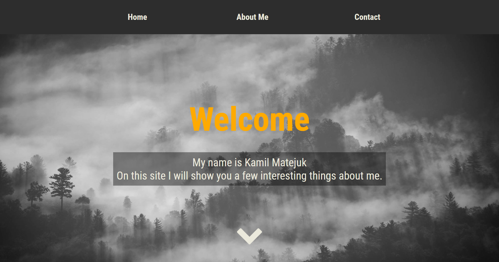

# Portfolio-Web-Page
First web page created during CodersCamp course. The goal was to get familiar with basic HTML5 + CSS3 combination. 
Most of the data is false or empty containers, just for the purpose od creating them.
 
 
Site avaliable at: https://kamilmatejuk.github.io/Portfolio-Web-Page/

# Used
* Bootstrap
* Flexbox
* Grid

